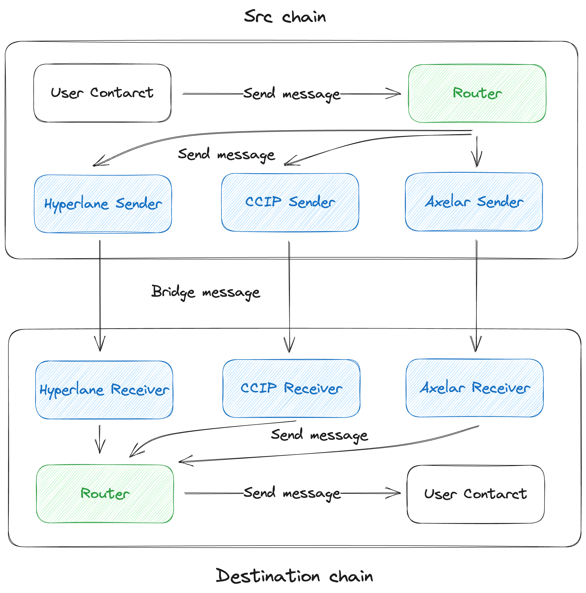

# Ishibashi ⽯橋

## Overview

This project aims to enable more secure execution of cross-chain messaging. It leverages multiple messaging protocols and allows setting k of n thresholds when sending messages. It utilizes multiple messaging protocols to send messages that meet the specified conditions. Upon receiving messages, it waits for k of n messages to be received before executing the messages.

## Architecture



## Flow

- Secure execution of cross-chain messaging.
- Utilizes multiple messaging protocols.
- Set k of n thresholds when sending messages.
- Utilizes multiple messaging protocols to send messages that meet the specified conditions.
- Waits for k of n messages to be received before executing the messages.

## Benefits

- Reduces the risk of hacking by using multiple messaging protocols with independent verifications.
- Improves the developer experience with a common interface.

## Drawbacks

Increased gas costs.

## Installation

```
yarn install
```

## Usage

Provide examples and instructions on how to use your project here.

## Contract Address

## Trasactions
